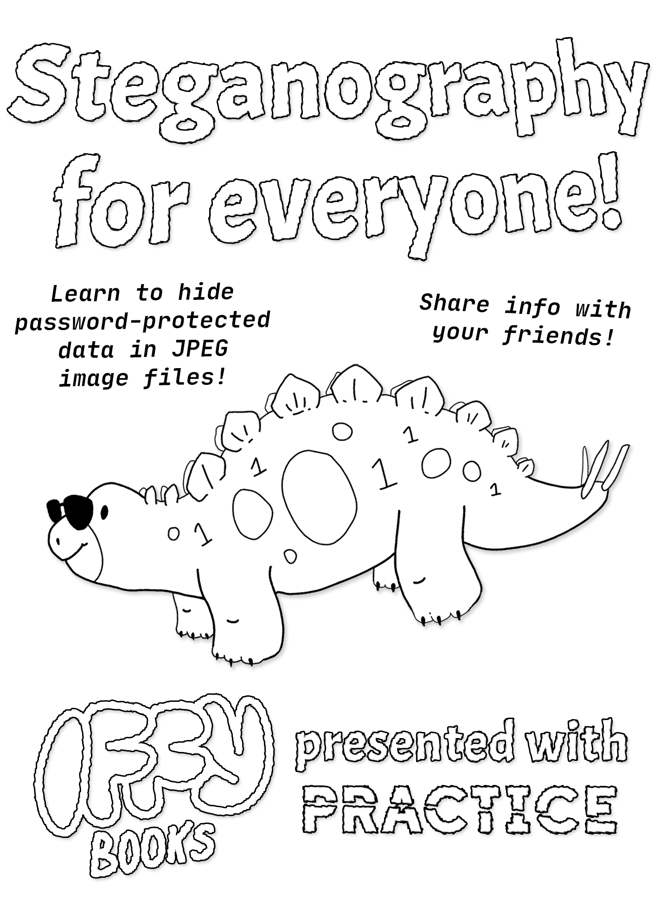

<div style="page-break-after: always;"></div>

# You should be able to send private messages to whomever you want.

If you’re trying to do something shady/creepy/right-wing with this knowledge, please stop reading and leave us alone. You’re not welcome here. 

Now that the pleasantries are out of the way,

## Convert your photo into a JPEG with ImageMagick

```
convert example_image.png example_image.jpg
```

```
convert -resize 50% IMG_5042.HEIC IMG_5042.jpg
```

# Steghide instructions for Linux

## Install Steghide

```
sudo apt install steghide
```

## Choose a good passphrase

You'll want to use a solid password to avoid brute force attacks.


[link to printable diceware list]


CaravanYenGraphFailing


## Embed data in a JPEG file

```
cd ~/Desktop
mkdir data
cd data
```

```
steghide embed -f -ef secret.txt -cf photo.jpg -sf /data/stego_file.jpg
```

You'll be prompted to enter a passphrase.

## Extract data from a JPEG file

```
steghide extract -sf stego_file.jpg
```

## 

## 

# Mac + Windows Instructions

## ## Download the project code

https://github.com/iffybooks/steganography-for-everyone

## Download and install Docker

## 

## Build the Docker image

```
cd /Users/iffybooks/Downloads/steganography-for-everyone/steghide-docker 
```

```
docker build -t steghide-docker .
```

Here's what the Dockerfile looks like:

```
FROM debian
RUN apt-get update \
    && apt-get install -y steghide  \
    && rm -rf /var/lib/apt/lists/*
WORKDIR /data
```

## Prepare your data

```
cd ~/Desktop
mkdir data
```

Go to your desktop and find the directory called **data**. Put a JPEG photo into the directory, along with a smaller file you're planning to hide.

## Embed data in a JPEG file

```
docker run -it --rm -v $(pwd)/data:/data steghide-docker steghide embed -f -ef /data/secret.txt -cf /data/photo.jpg -sf /data/stego_file.jpg
```

## Extract data from a JPEG file

```
docker run -it --rm -v $(pwd)/data:/data steghide-docker steghide extract -sf /data/stego_file.jpg
```

## Launch interactive shell (for troubleshooting)

```
cd ~/Desktop
mkdir data
docker run -it --rm -v $(pwd)/data:/data steghide-docker /bin/sh
```

## Further reading

- Steganography Toolkit    (a Docker image with various steganography tools)
  https://github.com/DominicBreuker/stego-toolkit

`docker pull dominicbreuker/stego-toolkit`

- Steghide official quick start page:
  https://steghide.sourceforge.net/documentation.php

- Steghide man page (manual):
  https://steghide.sourceforge.net/documentation/manpage.php
