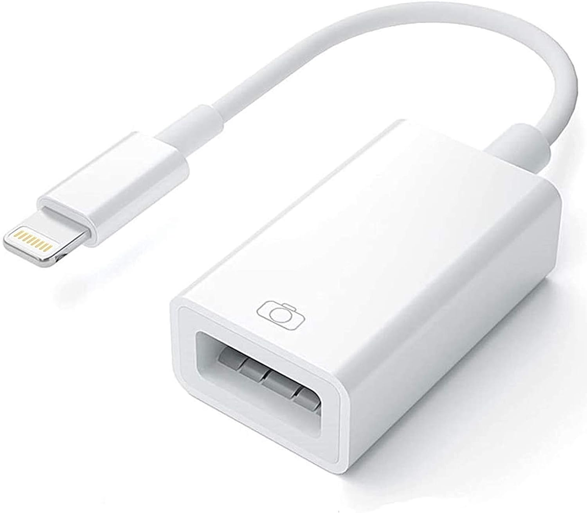

<div style="page-break-after: always;"></div>

# You should be able to communicate securely when you want to. There are currently plenty of good options for encrypted messaging ... but the future of the internet is unknown.

If you don't want other people to read a message you're sending to a friend, you can use **cryptography** to scramble it up so that no one else can read it. If someone is monitoring your communications, however, they'll definitely be able to see that you're sending/receiving messages that look scrambled. That means it's possible to build networks and services that detect encrypted messages and block them.    

If you don't think an encryption ban is a realistic possibility, check out what's happening in the UK: 
[https://www.reuters.com/world/uk/uks-online-safety-bill-passed-by-parliament-2023-09-19/](https://www.reuters.com/world/uk/uks-online-safety-bill-passed-by-parliament-2023-09-19/)

If you don't want your adversary to see your scrambled message and get wise to what you're doing, you can use **steganography** to conceal your secret message inside a message that looks innocuous.

Here are some ways you could potentially use steganography:

• Exchange off-the-record messages via ordinary email, hidden in vacation photos.

• Run a photo blog with the location of a secret rave embedded in every image, readable by folks with the password.

• Store something personal (like a private encryption key or your diary) in a photo of your cat.

• Create an elaborate alternate reality game with a series of riddles hidden in photos scattered across the web, taking players on a twisty path that leads to your Bandcamp page.

We're approaching this project with a spirit of old-school hacker curiosity. We like trying things out and seeing what's possible. But we're super ethical, super antifascist, and we don't have time for libertarian nonsense. If you’re trying to do something creepy/right-wing with the knowledge in this zine, please fuck off and leave us alone. We don't want anything to do with you.

Now that the pleasantries are out of the way, let's get started!

## Overview

In this workshop you'll use the command-line program **steghide** to hide secret, encrypted messages inside JPEG image files.

If you're using Linux, you should be able to install steghide with your package manager. Installing steghide on macOS & Windows is trickier, so we recommend running it via Docker. 

You can find this zine on our website at the following URL
[https://iffybooks.net/steganography](https://iffybooks.net/steganography)

Source code and example files are on GitHub:
[https://github.com/iffybooks/steganography-for-everyone](https://github.com/iffybooks/steganography-for-everyone)

## How do you hide data in a photo?

Most digital photos you'll come across use RGB color, which means each pixel is made up of three number values: an integer for the degree of redness, an integer for green, and an integer for blue. In an 8-bit image, those numbers can be `0` through `255`.

In the language of math & computer science, a **bit** is the smallest possible piece of information, equivalent to the choice between `0` and `1`. The outcome of a coin toss is one bit of information.

To hide a single bit of information in a pixel, we can simply overwrite the least significant bit in one of the color values. Let's say the pixel's red value is `224`, which translates to `11100000` in binary. To store the bit `1` in the pixel, we'd change the value to `11100001`. To store the bit `0`, we'd leave it as-is. Encoding messages in a photo this way is equivalent to adding noise to the image.

The program `steghide` does something like the steps described above, as well as using a lot of sophisticated math to cover its tracks.

## Take a photo

You'll start by creating two files: a JPEG image and a smaller file you'll conceal inside it. For the JPEG file, you'll want to use an image that isn't available elsewhere on the web. Here's why:

Let's say you grab a photo from a stock photo site, hide your secret message in it, and post the updated image file on your blog. If an adversary suspects you're using steganography, they can do a reverse image search and find the original file. If the images look similar but the JPEG on your site is slightly larger, that's a clue you may be using steganography.

❏ Take a photo using your phone or a digital camera.

## Transfer the photo to your computer

❏ Go to the desktop on your computer and create a new directory called `data`. 

❏ Transfer your new photo to your computer and put it in the `data` directory. 

↳ You can transfer the file using cloud storage, but then you've made a copy of the original file that can hypothetically be compared to the version with a hidden message. Best to avoid cloud storage if possible, at least for this workshop.

↳ If you're using iOS and macOS, transferring the file via AirDrop is a good option.

↳ For both iOS and Android, you can get an adapter that lets you connect a USB thumb drive or microSD card to your phone. It's a handy trick for transferring files to a computer without using the internet.

&nbsp;&nbsp;&nbsp;&nbsp;&nbsp;&nbsp;&nbsp;&nbsp;&nbsp;&nbsp;&nbsp;&nbsp; 

## Install ImageMagick (optional)

If the filename of the photo you just transferred to your computer ends with ".jpg" or ".jpeg", you can skip this step and the next one. If you're using a digital camera or Android phone, this probably includes you.

If you're using an iPhone your photo will be in HEIC format (High Efficiency Image File Format), which you'll need to convert to JPEG.

### *Debian-based Linux (Ubuntu etc.)*

You'll install ImageMagick using the **apt** package manager. 

❏ First you'll open a terminal window. Click the square grid icon in the lower left corner of the screen, type "terminal", and select the application called Terminal. 

❏ Run the following two commands, which will update apt's list of packages and install ImageMagick. You'll need to enter your password.

```
sudo apt update
sudo apt install imagemagick
```

### *macOS*

❏ Open the **Terminal** application. You can search for it using Spotlight or find it in this directory: `/Applications/Utilities/`

❏ Go to the following URL and follow the instructions to install the Homebrew package manager. You'll need to copy a line of code, paste it into your terminal, and press enter.

https://brew.sh

*Warning:* If you haven't used the command line much before, at this point you'll be prompted to install a bundle of tools and libraries from Apple that will take a long time to download (possibly 20 minutes or more). If you're at an in-person workshop, you may want to skip this step and finish at home.

❏ Once Homebrew in installed, run the following command to install ImageMagick:

```
brew install imagemagick
```

### *Windows*

❏ Go to the URL below and follow the instructions to install the Chocolatey package manager:
https://chocolatey.org/install

❏ Open PowerShell. 
↳ Or, for a more Linux-like shell experience, install and launch Git Bash:
https://git-scm.com/downloads

❏ Run the following command to install ImageMagick.

```
choco install imagemagick
```

## Convert your photo to JPEG with ImageMagick (optional)

❏ Open a terminal window and run the following command to `cd` (change directory) to the `data` directory on the desktop.

```
cd ~/Desktop/data
```

↳ In Windows, try the command `cd Desktop/data` in a new PowerShell (or Git Bash) window instead.

❏ Run the command `ls` and you'll see the HEIC file you just transferred to your computer.

```
ls
```

❏ Type out a command like the one below, swapping in the filename of your HEIC file. The second filename is the output filename, which can be anything as long as it ends with `.jpg`. Press enter to run the command.

```
convert IMG_5042.HEIC IMG_5042.jpg
```

❏ In your file explorer/Finder, go to the desktop and open the `data` directory. You should see the JPEG file you just created. 

❏ To resize your photo to the size you want, you can add the `-resize` option followed by the percentage you want, as in the command below:

```
convert -resize 50% IMG_5042.HEIC IMG_5042.jpg
```

↳ If you have trouble installing ImageMagick, or if you prefer using a program with a GUI, another option is to install GIMP (Gnu Image Manipulation Program) and use it to convert HEIC files to JPEGs. You can download it here:
https://www.gimp.org

## Create your secret message

Next you'll create/choose your secret message file. You can embed any kind of file you want, as long as it's smaller (<10%-ish) than the JPEG you're hiding it in. 

❏ Open a plaintext editor (such as Sublime Text) and write a secret message. Save it to the `data` directory on your desktop, with a filename like `secret.txt`.

↳ Alternately, find a small image or text file on the web and save it to your `data` directory.

## Generate a strong passphrase

It's *very* important to use a strong passphrase that you haven't shared or used elsewhere. 

One way to defeat password protection is to use a **brute force** attack, which involves guessing billions of possible passwords until one works. Brute force attacks aren't practical for online services like email, because the service provider will limit the number of guesses per second and shut off access after a certain number of attempts. 

Password-protected files are different, because there's no service provider in the loop to limit the number of guesses allowed. If someone has a lot of computing power, they can try millions of guesses per second until they land on the right combination.

One option is to use a totally random password like `0Q8&fLahAAv57L?bUjRt`, which you can generate and store using a password manager.

If you need a passphrase you can remember, a good strategy is to use four ordinary words selected at random. This XKCD comic explains, in condensed form, why this approach is sound:


To generate a passphrase in this style, you'll need to choose words at random from a list. One way to do it is to use a **diceware list**, which maps sequences of dice rolls to words. Rolling dice is reliably random and not easily surveilled.

You can find a diceware list at the following URL:
[https://www.eff.org/dice](https://www.eff.org/dice)

Or download a printable PDF from our website:
[https://iffybooks.net/Diceware_List.pdf](https://iffybooks.net/Diceware_List.pdf)

❏ To select a word from the diceware list, roll a 6-sided die five times and write down the outcomes (or roll 5 dice simultaneously). You'll end up with a sequence of numbers like `14636`.

❏ In the diceware list, find the word that corresponds to the numbers you rolled. If you look up `14636` you'll find the word `caravan`.

❏ Repeat the process and select three more words. Your final passphrase will look something like this: `CaravanYenGraphFailing`

# Steghide instructions for Linux

## Install Steghide (Linux)

❏ Open a terminal window and run the commands below to update the `apt` package manager and install steghide:

```
sudo apt update
sudo apt install steghide
```

<div style="page-break-after: always;"></div>

## Embed data in a JPEG file (Linux)

❏ First, `cd` to the `data` directory on your desktop. (You can skip this step if you're already there.)

```
cd ~/Desktop/data
```

❏ Type out the following command, replacing `secret.txt` with the name of your secret file and `photo.jpg` with the name of your JPEG file. In the example below, the output file will be called `stego_file.jpg`.

```
steghide embed -ef secret.txt -cf photo.jpg -sf stego_file.jpg
```

❏ At the prompt, enter the passphrase you generated earlier.

❏ In the file explorer/Finder, go to the `data` directory on the desktop. You should see a new JPEG file (`stego_file.jpg` in the example) which contains your encrypted message. Compare the size of the altered file to the original JPEG.

❏ Open both JPEG files with an image viewer application and compare them. Do you see a difference? (Hint: You can probably see a difference.)

<div style="page-break-after: always;"></div>

## Extract secret data from a JPEG file (Linux)

❏ To extract the secret file from a JPEG file, run a command like the one below. You'll replace `stego_file.jpg` with the name of your altered JPEG file.

```
steghide extract -sf stego_file.jpg
```

Enter the passphrase at the prompt and your secret file will be written to the current directory.

<div style="page-break-after: always;"></div>

# Steghide instructions for macOS + Windows

## Download and install Docker

❏ Go to the following URL and follow the instructions to install Docker Desktop:
[https://docs.docker.com/engine/install/](https://docs.docker.com/engine/install/)

## Download the project code

❏ Go to the following URL:
[https://github.com/iffybooks/steganography-for-everyone](https://github.com/iffybooks/steganography-for-everyone)

❏ To download the code, click **Code** and select **Download ZIP** from the dropdown menu.

❏ Find the ZIP file you just downloaded, `steganography-for-everyone-main.zip`. Double click the file to unzip it, which should create a directory called `steganography-for-everyone-main`.

## Build the Docker image

In the directory `steganography-for-everyone-main`, there's another directory called `steghide-docker`. This contains a file called `Dockerfile`, which contains code that tells Docker what components to download.

❏ To build the Docker image you'll use to run `steghide`, you'll need to `cd` into the directory `steghide-docker`.

Open a terminal window and type `cd` followed by a space.

Next, in your file explorer/Finder, find the `steghide-docker` directory and drag it onto the terminal window. You'll end up with a command like the one below, with the directory's full pathname. Press enter to run the command.

```
cd /Users/iffybooks/Downloads/steganography-for-everyone/steghide-docker 
```

❏ Next, type out the command below and run it to build your docker image. The `-t` option specifies that the image will be called `steghide-docker`. The period (`.`) at the end means Docker should look for a Dockerfile in the current directory.

```
docker build -t steghide-docker .
```

Docker will take a few minutes to download the necessary components and build the image.

If you're curious, here's what the Dockerfile we're using looks like. It's short and to the point:

```
FROM debian
RUN apt-get update \
    && apt-get install -y steghide  \
    && rm -rf /var/lib/apt/lists/*
WORKDIR /data
```

<div style="page-break-after: always;"></div>

## Embed data in a JPEG file (Docker)

❏ Run the command below to `cd` to the desktop.

```
cd ~/Desktop
```

❏ Type (or copy and paste) the Docker command below into your terminal window and press enter. In the example, we have a directory called `data` on the desktop which contains a JPEG called `photo.jpg` and a secret message called `secret.txt`. The output file will be called `stego_file.jpg`.

```
docker run -it --rm -v $(pwd)/data:/data steghide-docker steghide embed -f -ef /data/secret.txt -cf /data/photo.jpg -sf /data/stego_file.jpg
```

❏ At the prompt, enter the passphrase you generated earlier.

❏ In the file explorer/Finder, go to the `data` directory on the desktop. You should see a new JPEG file (`stego_file.jpg` in the example) which contains your encrypted message. Compare the size of the altered file to the original JPEG.

❏ Open both JPEG files with an image viewer application and compare them. Do you see a difference? (Hint: You can probably see a difference.)

## Extract data from a JPEG file (Docker)

❏ Run the command below to `cd` to the desktop.

```
cd ~/Desktop
```

❏ To extract the secret file from a JPEG file, run a command like the one below. You'll replace `stego_file.jpg` with the name of your altered JPEG file.

```
docker run -it --rm -v $(pwd)/data:/data steghide-docker steghide extract -sf /data/stego_file.jpg
```

Enter the passphrase at the prompt and your secret file will be written to the `data` directory on your desktop.

## Remove image metadata with exiftool

For good measure, you may want to remove all the metadata from your altered JPEG file before sharing it. To do this, you can use the program `exiftool`.

❏ You can install `exiftool` it with `apt` on Ubuntu, with `brew` on macOS, and with `choco` on Windows.

❏ To remove metadata from an image, first `cd` to the directory where it's located.

```
cd ~/Desktop/data/
```

❏ Run the command below to remove metadata, substituting your filename for `stego_file.jpg`

```
exiftool -all= stego_file.jpg
```

This technique removes most of the obvious metadata from an image file, such as unique identifier strings and GPS coordinates. But there may be other identifiers 

## Caveats to keep in mind

- Social media sites like Instagram and Facebook will re-compress every image you upload, which will most likely destroy your hidden message. Just a heads-up.

- It's possible your hidden message will be able to be detected in the future if someone finds a flaw in the way steghide works.

- Writing down your password is a liability. Be thoughtful about it.

- Be careful who you share passwords with.

- Depending on your situation, having steghide installed on your computer may look suspicious. Uninstalling things when you're done is an option.

## Further reading

- Steghide official quick start page:
  https://steghide.sourceforge.net/documentation.php

- Steghide man page (manual):
  https://steghide.sourceforge.net/documentation/manpage.php

- Steganography Toolkit (a Docker image with various steganography tools preinstalled)
  https://github.com/DominicBreuker/stego-toolkit
  
  Run this command to download the image: `docker pull dominicbreuker/stego-toolkit`

- 'Digital image steganography: Survey and analysis of current methods' (Cheddad, Condell, Curran, and McKevitt 2010)
  https://www.sciencedirect.com/science/article/abs/pii/S0165168409003648

<div style="page-break-after: always;"></div>

<br />
<br />
<br />
<br />
<br />
<br />
<br />
<br />
<br />
<br />
<br />
<br />
<br />


**Anti-copyright 2023**

**iffybooks.net/steganography**

<br />
<br />

**Iffy Books**&nbsp;

**319 N. 11th St. #2I, PHL**
